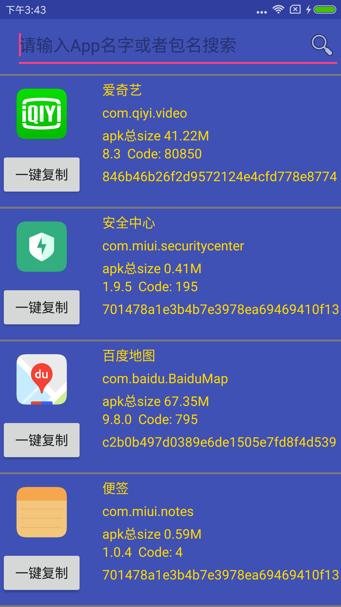
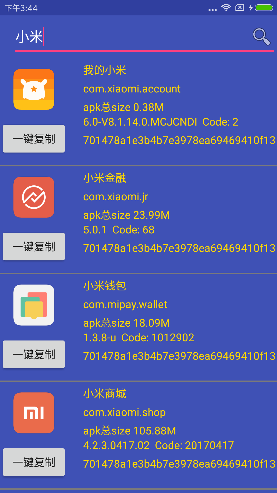
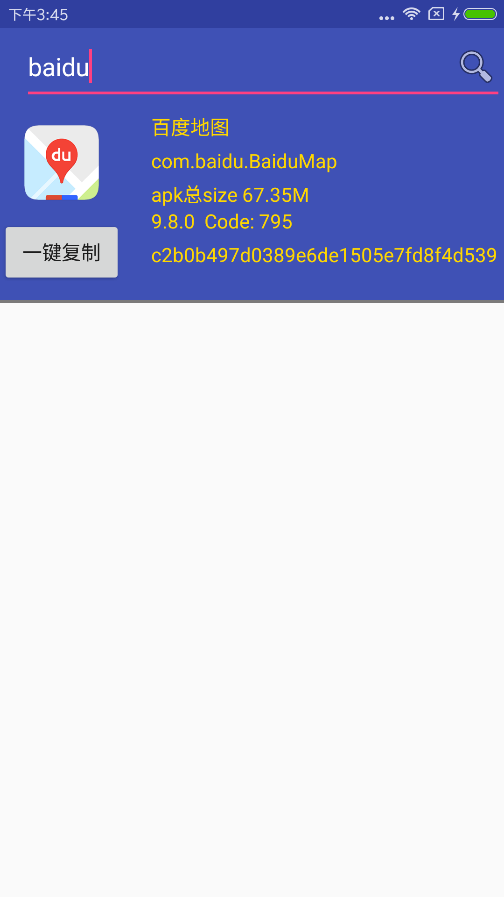

## AppManger 一款直接显示App所有信息的App
1. 开发时 ：是否遇到经常需要查看App的签名，每次要去自己计算太麻烦，第三方App,还要输入包名也太麻烦
2. 有时需要去查看App的当前版本号，版本名字
3. 现在这款App全满足（代码非常简单 ）
4. 异步的耗时查询用到了 [Rxjava2.0 ][1]
5. 列表RecyclerView适配器用的是我们的官方  [BaseRecyclerViewAdapterHelper][2]
6. 获取App 应用大小 采用AIDL接口实现
7.  
8. App本地下载地址[https://o6bw6tmdt.qnssl.com/app-release.apk][4]

9. 
10. 
11. 
## 效果图

  [1]: https://github.com/ReactiveX/RxJava
  [2]: https://github.com/CymChad/BaseRecyclerViewAdapterHelper
  [3]: https://play.google.com/store/apps/details?id=com.allen.appmanager
  [4]: https://o6bw6tmdt.qnssl.com/app-release.apk
